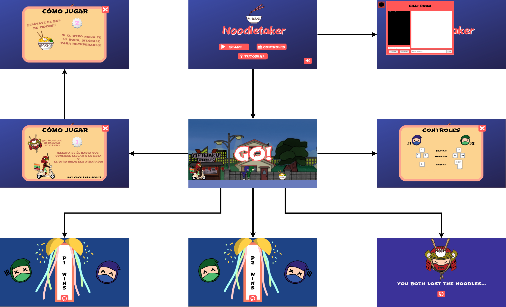

# Noodletaker
La temática del juego es "Japón moderno mezclado con figuras del Japón feudal"

**Integrantes del grupo**:
1. **NOMBRE:** Ismael Jiménez Martínez | **CORREO:** i.jimenezm.2018@alumnos.urjc.es | **USUARIO:** _gossipxbabylon_
2. **NOMBRE:** Juan Antonio Calero Crespo | **CORREO:** ja.calero.2017@alumnos.urjc.es | **USUARIO:** C4lipo
3. **NOMBRE:** Manuel Abarca Crespo | **CORREO:** m.abarca.2018@alumnos.urjc.es | **USUARIO:** _dakeXd_
4. **NOMBRE:** Elena Pontijas Martín | **CORREO:** e.pontijas.2018@alumnos.urjc.es | **USUARIO:** _miniponti_

### 1.- Introducción
#### 1.1.- Concepto principal
NoodleTaker es un juego ambientado en el Japón actual. Un samurái repartidor de fideos persigue a dos ninjas enemigos que aparecen para robarle los pedidos y así quedarse ellos con el dinero. Estos dos ninjas compiten el uno contra el otro para llegar a la meta mientras al mismo tiempo escapan del samurái que los persigue para castigarlos.
  
#### 1.2.- Características principales
1. Jugabilidad sencilla
2. Competitividad
3. Rejugabilidad
4. Dinamismo
5. Número de jugadores: 2
6. Plataforma: PC (Windows, Mac, Linux)

#### 1.3.- Género
Runner: el jugador se mueve constantemente por un mapa avanzando de manera horizontal mientras esquiva distintos obstáculos y recoge diversos objetos para ayudarle a avanzar.

#### 1.4.- Propósito y público específico
El principal propósito de NoodleTaker es conseguir que los jugadores vivan una  experiencia competitiva, pero divertida. Es un juego casual y como tal atraerá a personas de todas las edades que quieran pasar un buen rato con algún amigo, gracias al apartado multijugador. 

#### 1.5.- Licencia
___CC BY-NC-SA (Reconocimiento-NoComercial-CompartirIgual).___

Esta licencia permite a otras personas, mezclar, adaptar y construir a partir del proyecto no comercialmente, siempre que se nos acredite y se publique bajo la misma licencia.

### 2.- Mecánicas del juego
#### 2.1.- Tipo de cámara
__Cámara neutra__: La cámara toma una perspectiva lateral, perpendicular a la dirección en la que los jugadores se mueven (es decir, la cámara está apuntando hacia delante según la perspectiva del jugador y los personajes se mueven de izquierda a derecha). Se asemeja a las cámaras usadas en los videojuegos “Super Mario Bros” y “Hollow Knight” o de categoría “plataforma”. 

#### 2.2.- Controles
* Offline (desde un mismo ordenador)
	* Jugador 1 usa las teclas WASD
		* W = Saltar.
		* A = Moverse a la izquierda.
		* D = Moverse a la derecha.
		* E = Atacar y robar noodles.
	* Jugador 2 usa las flechas
		* ↑ = Saltar.
		* ← = Moverse a la izquierda
		* → = Moverse a la derecha.
		* Tecla Enter = Atacar y robar noodles.

#### 2.3.- Jugabilidad
* **Movimiento de los jugadores**: la jugabilidad se basa en un espacio de dos dimensiones en el que se puede avanzar horizontal y verticalmente, creando un entorno similar al de los juegos de plataformas.

* **Movimiento de la cámara**: La cámara del juego se mueve constantemente, hasta que la barra de progreso llegue al final o pierda en medio de la partida (bien porque el samurái le atrapa o porque uno de los obstáculos le impide avanzar).

* **Plataformas y obstáculos**: a medida que avanza la partida, van surgiendo plataformas que intentarán empujar a los jugadores hacia el samurái y que deben esquivar o interactuar con ella para continuar jugando.

* **Atacar**: Los dos jugadores pueden atacarse entre sí, si se pulsa la correspondiente tecla de ataque y si un jugador entra en contacto con el otro. El efecto del ataque es robarle los noodles al otro jugador y empujarle.

#### 2.4.- Niveles
Sólo hay un nivel en todo el juego:

* Se plantea un nivel estándar en el que los jugadores deben esquivar los obstáculos hasta que uno de los jugadores pierda o lleguen al final del recorrido.

* Cuando se haya finalizado este nivel, se habrá acabado la partida y por tanto se mostrarán los resultados.

#### 2.5.- Condiciones de victoria
Es una única partida en la que se decide el ganador. Un jugador sale victorioso de un nivel cuando:

* El otro jugador es capturado por el samurái que persigue a ambos.

* Cuando se llega al final del recorrido, el ninja que posea el tazón de noodles, es el ganador.

#### 2.6.- Obstáculos
* **Plataformas**: Las plataformas son el único obstáculo del juego, aparecen por la derecha de la pantalla y van hacia el jugador de derecha a izquierda (siguiendo el autoscroll del nivel) y se esquivan saltando sobre ellas o yendo por debajo (si es posible).

#### 2.7.- Habilidades
* **Sumashu (Smash)**: si un jugador toca esta habilidad, en la pantalla se muestra un mensaje de emergencia y, a continuación, sale un personaje llamado Todo Mítico que le da un puñetazo al ninja controlado por el otro jugador y lo empuja hacia atrás.

#### 2.8.- Guía
En la pantalla del título, se le da la opción al jugador de pulsar un botón que muestre un pequeño tutorial para que los jugadores entiendan desde el principio cuál es su objetivo, cuáles son los controles para interactuar con el juego y cuáles son las condiciones de victoria y de derrota.

### 3.- Estados del juego
NoodleTaker consta de los siguientes estados:
	* **Menú de inicio:** es lo primero que ve el jugador al arrancar el juego. Consta de un botón de empezar partida "START", uno para el tutorial "HOW TO PLAY", otro para 	los controles "CONTROLS" y por último uno para el audio.
	* **Partida empezada:** tras pulsar el botón de comienzo, los jugadores ya pueden comenzar a jugar.
	* **Menú de fin de juego:** aparece cuando se ha superado el nivel y ya se ha establecido el ganador.
	
	
### 4.- Arte
#### 4.1.- Interfaz
* **Pantalla de inicio:** al arrancar el juego y antes de empezar a poder jugar, aparece un menú de inicio en el que hay un botón que pone “START”, el cual si se pulsa, el juego se pone en funcionamiento.

* **Durante el juego:** una vez arranca la partida, el menú de inicio desaparece y en la pantalla aparece una barra de progresión de nivel. Ésta se encuentra en la parte superior de la pantalla e indica a los jugadores lo que llevan recorrido de nivel y cuánto les falta para terminar. Comienza siendo un rectángulo vacío, pero que cuanto más avanza la partida, más se va llenando. Cuando está totalmente llena significa que se ha llegado al final.

* **Pantalla de fin de juego:** aparece cuando se han superado el nivel. En esta parte hay un botón para reiniciar la partida y comenzar una nueva.

* **Pantalla de nivel completado:** sale cuando se ha completado el nivel, bien sea porque un jugador ha llegado al final de la meta o bien porque los obstáculos le han impedido seguir jugando. Cuando esto ocurre, aparece quién es el ganador del nivel y un botón patra reiniciar la partida.

#### 4.2.- Personajes
* Jugables
	* Ninja 1
	* Ninja 2
* No jugables
	* Samurai
	* El Todo Mítico
	
#### 4.3.- Objetos
Aparecen a lo largo del escenario de manera “semialeatoria” (tendrán unas posiciones determinadas en las que podrán o no aparecer), son de un solo uso y se utilizan en el momento en el que un jugador entra en contacto con la imagen que representa al objeto, afectando al otro jugador (si son perjudiciales) o al jugador que los obtiene (si son beneficiosos) . 
Debido a que los objetos que se han diseñado se basan en un sistema de “invocaciones” a ayudantes, estos se mostrarán en pantalla para ambos jugadores antes de hacer efecto en el mismo. De esta forma el jugador que es afectado se puede preparar ante el ataque inminente según el tipo de objeto que haya obtenido el rival.

#### 4.4.- Escenarios
Hay un único escenario divido en dos capas para usar el efecto de parallax scrolling.

* **Fondos** El fondo es dinamico conforme el nivel avance, pero no es acorde a la aparición de las plataformas a lo largo del nivel (parallax mapping).
	
* **Plataformas** Las plataformas irán apareciendo por la parte derecha del nivel y se moverán hacia la izquierda conforme los personajes se muevan por el escenario.

### 5.- Diagrama de clases

### 6.- Gestion de cliente/servidor
El servidor está formado por una sala principal que almacena una lista de jugadores conectados y un registro de mensajes almacenado en un txt en memoria local (este txt tiene el nombre de la ID de su sala). 

Los clientes se pueden conectar al servidor con una petición de tipo POST, en la que se incluye en el cuerpo de la petición el ID que va a tener el cliente dentro del servidor. 

El servidor enviará como respuesta un objeto de la clase Jugador, donde estarán incluídos como atributos la ID del jugador y la ID de la sala a la que se ha conectado. 

Una vez que un cliente esté conectado, tendrá que enviar una petición de tipo GET (un ping) constantemente indicando la ID del jugador y la ID de la sala a la que se hace, la cual enviará en el cuerpo de la respuesta un objeto con la lista de jugadores conectados a la sala y la lista de mensajes enviados en la sala. Si alguno de los clientes conectados no envía un ping en un tiempo determinado (2 segundos) se le desconectará de la sala, por lo cual no podrá enviar ni recibir mensajes de la sala hasta que se vuelva a conectar. Si un cliente intenta conectarse con la ID de un jugador ya conectado, el servidor devolverá null, que en el cliente se interpretará como que esa ID ya está registrada. 

Si el servidor no está conectado, el cliente interpretará los fallos en sus peticiones de GET o POST como que el servidor está offline.  
